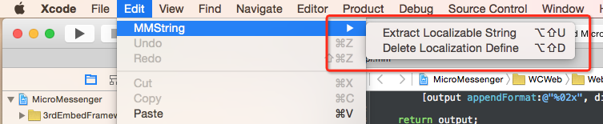
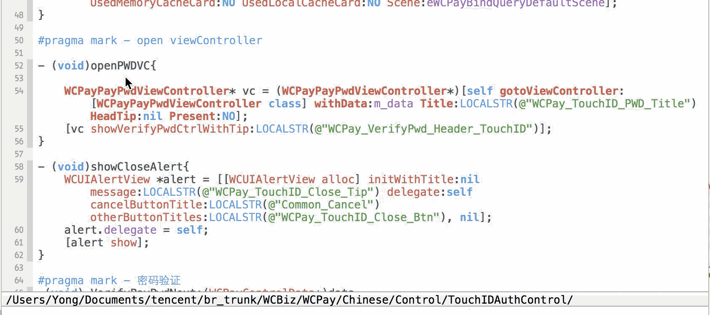
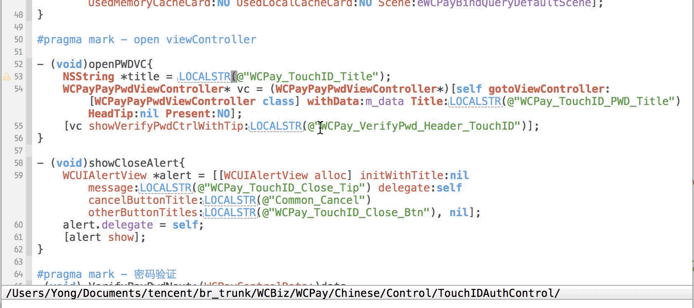
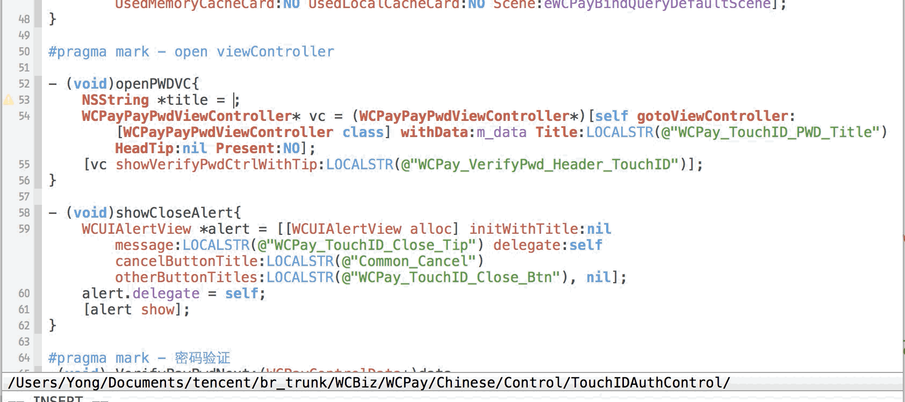

#Lin
---
Develop based on [Lin](https://github.com/questbeat/Lin) and [extract-localizable-string-plugin-xcode](https://github.com/viniciusmo/extract-localizable-string-plugin-xcode). It not only can extract localizable string but also provides auto-completion for localized key.

#Install
**Support Xcode 7.1 Beta**

```
Option 1: run install_plugin.sh, and restart XCode;
Option 2: copy Lin.xcplugin to "~/Library/Application Support/Developer/Shared/Xcode/Plug-ins/"
```
#Uninstall
```
Delete Lin.xcplugin at "~/Library/Application Support/Developer/Shared/Xcode/Plug-ins/"
```
----
#Menu


#Add
### Shortcut key: Shift + Option + U
<br/>


#Change
### Shortcut key: Shift + Option + U
<br/>


#Auto Complete Search


#Delete
### Shortcut key: Shift + Option + D (delete in mm.strings also)
<br/>


###References:

[Lin](https://github.com/questbeat/Lin)

[extract-localizable-string-plugin-xcode](https://github.com/viniciusmo/extract-localizable-string-plugin-xcode)


